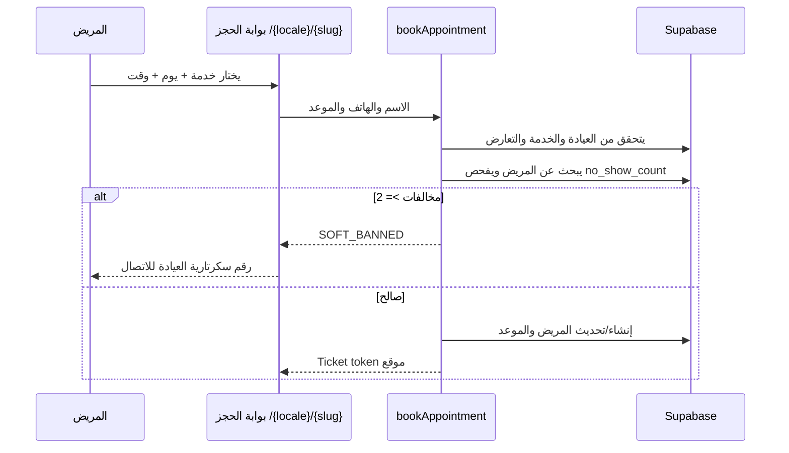

# Nawa (نواة) — البنية الحالية

> آخر تحديث: 2026-07-17
> نظام SaaS متعدد العيادات لإدارة الاستقبال، المواعيد، المرضى، السجل الطبي، المالية، المخزون، والحجز العام.

## 1. التقنية

| الطبقة | التقنية الحالية |
|---|---|
| التطبيق | Next.js 14 App Router + React 18 + TypeScript |
| قاعدة البيانات والمصادقة | Supabase PostgreSQL + Auth + Storage + Realtime |
| الواجهة | Tailwind CSS 3 + Nawa design tokens |
| الحركة | Framer Motion |
| السحب والإفلات | `@hello-pangea/dnd` |
| النماذج والتحقق | React Hook Form + Zod |
| الرسوم | Recharts |
| PDF / الطباعة | jsPDF + html2canvas + browser print |
| الترجمة | `next-intl` (`ar` افتراضي، `en` ثانوي) |

## 2. المسارات الفعلية

```text
src/app/
├── [locale]/
│   ├── page.tsx                         # Landing
│   ├── (auth)/login|register            # دخول وإنشاء عيادة
│   ├── [slug]/page.tsx                  # بوابة الحجز العامة
│   ├── [slug]/success/page.tsx          # تذكرة حجز موقعة + QR
│   └── dashboard/
│       ├── page.tsx                     # Reception Mission Control
│       ├── notifications/page.tsx       # Unified notification inbox
│       ├── patients/                    # CRM + ملف المريض
│       ├── upcoming/                    # الأجندة المستقبلية
│       ├── services/                    # إدارة الخدمات
│       ├── inventory/                   # المخزون
│       ├── financials/                  # المالية
│       ├── analytics/                   # التحليلات
│       ├── recalls/                     # الاستدعاءات
│       └── settings/
│           ├── profile/                 # هوية الطبيب وبيانات العيادة
│           └── schedule/                # ساعات العمل والشفتات
└── (super-admin)/super-admin/           # إدارة المنصة والعيادات
```

`/dashboard/agenda` يحوّل إلى `/dashboard/upcoming`.
`staff` و`marketing` و`ai-assistant` ما زالت صفحات **Coming Soon** وليست منتجات مكتملة.

## 3. تعدد العيادات والأمان

- كل صف تشغيلي يحمل `tenant_id`.
- `public.get_tenant_id()` يقرأ `app_metadata.tenant_id` من JWT.
- RLS مفعّل ومفروض على الجداول tenant-scoped.
- الاستعلامات الداخلية تستخدم `createAuthenticatedClient()` ثم `resolveTenantId()`.
- الحجز العام يستخدم Service Role **على السيرفر فقط**، مع التحقق من `slug` وملكية الخدمة.
- حالة العيادة والاشتراك تُراجع قبل السماح بتحميل بيانات لوحة التحكم أو بوابة الحجز.
- `/super-admin` له gate منفصل ولا يعرض PHI في إحصائيات المنصة.

> ملاحظة: منطق الحجز العام الحالي موجود في Server Actions، وليس RPC `book_appointment` كما كانت تشير النسخة القديمة من هذه الوثيقة.

## 4. قاعدة البيانات الحالية

### الجداول الأساسية

| الجدول | الغرض |
|---|---|
| `tenants` | العيادة، الاشتراك، الهوية العامة، الهاتف، العنوان، وإحداثيات الموقع |
| `services` | الخدمة، المدة، السعر، وتعليمات ما قبل الزيارة |
| `patients` | بيانات المريض، المخالفات، الملاحظات، الأرشفة، والرصيد المستحق |
| `appointments` | الموعد، الحالة، ملاحظات الطبيب، إعادة الكشف، والموعد البديل |
| `patient_payments` | دفتر دفعات المريض |
| `patient_media` | صور وأشعة EHR مع مسارات Storage |
| `working_hours` | أيام العمل والشفتات المتعددة |
| `blocked_slots` | الاستثناءات والفترات المحجوبة |
| `inventory_items` | الأصناف، الرصيد، الحد الأدنى، والتكلفة |
| `tenant_subscriptions` | حالة اشتراك العيادة وتاريخ الانتهاء |

### حالات الموعد

```text
pending → confirmed → checked_in → in_session → completed
                         └──────→ no_show
أي حالة تشغيلية ────────────────→ canceled
```

الحالات الفعلية:
`pending`, `confirmed`, `checked_in`, `in_session`, `completed`, `no_show`, `canceled`.

### أهم توسعات الـ schema

| Migration | الإضافة |
|---|---|
| `005` | `canceled` + Realtime |
| `006` | سعر الخدمة وتعليماتها |
| `007` | `in_session` |
| `008` | CRM notes/archive/backfill |
| `009` | EHR media + Storage |
| `010` | الدفعات والأرصدة |
| `011` | ملاحظات الطبيب |
| `012` | إعادة الكشف |
| `013` | تعطيل العيادة |
| `014`–`015`, `020` | ساعات العمل، الحجب، والشفتات |
| `017` | الاشتراكات |
| `018` | الهوية الرقمية للطبيب |
| `019` | المخزون |
| `021` | هاتف العيادة، العنوان، Latitude/Longitude |

## 5. التدفقات الرئيسية

### الاستقبال اليومي

`fetchTodayAppointments()` يجلب مواعيد اليوم، مدفوعات اليوم، متأخرات أمس، تأكيدات الغد، الخدمات، والصلاحيات.
`DashboardShell` يعرض:

1. عمليات سريعة وWalk-in مدمج.
2. ساحة حية قابلة للسحب: بالخارج → الانتظار → عند الطبيب.
3. رادار الغرف، شريط الخزنة، ونسبة الإشغال.

تغيير العمود يحدث تحديثًا تفاؤليًا ثم `updateAppointmentStatus()` مع rollback عند الفشل.

### الحجز العام



رقم الاتصال في حالة المخالفة يأتي من `tenants.clinic_phone`، مع fallback من إعدادات البيئة.
زر الوصول للعيادة يستخدم `clinic_latitude/clinic_longitude`، أو العنوان النصي إذا لم توجد إحداثيات.

### ملف المريض

- Header ثابت به الهوية، إجمالي الزيارات، آخر زيارة، والرصيد.
- 3 تبويبات: السجل الطبي، المواعيد، الحسابات.
- EHR مرئي: صور، أشعة، timeline، مقارنة قبل/بعد، Theater mode.
- تسجيل دفعات وتقليل الرصيد.
- e-Prescription overlay: بحث/قوالب/معاينة ورقية/طباعة/WhatsApp/حفظ.

> V1 للروشتة يحفظ نسخة نصية منظمة داخل `patients.notes`؛ لا يوجد جدول prescriptions مستقل حتى الآن.

### الإشعارات

- Realtime booking inserts → toast + صوت + unread state.
- Slide-over drawer بمرشحات وإجراءات سريعة.
- `/dashboard/notifications` يعرض Unified Inbox بنظام master-detail.
- مخزون منخفض، أرصدة، إلغاءات، وحجوزات لها context actions.

> حالة القراءة محفوظة في React context أثناء الجلسة، وليست persisted في قاعدة البيانات حتى الآن.

## 6. Storage وRealtime

- Bucket `clinic_ehr`: صور وأشعة المريض، URLs موقعة، ومسارات tenant-scoped.
- Bucket `clinic-branding`: صورة الطبيب وغلاف صفحة الحجز؛ سياساته الحالية أوسع من EHR ولا يجب اعتباره محميًا بنفس مستوى عزل المسار.
- Realtime على `appointments` يستخدم حاليًا لإشعارات الحجوزات الجديدة فقط.
- صفحة Mission Control لا تعيد مزامنة الساحة الحية نفسها عبر Realtime؛ تعتمد على snapshot السيرفر والتحديث المحلي بعد السحب/Walk-in.

## 7. Environment Variables

| المتغير | الاستخدام |
|---|---|
| `NEXT_PUBLIC_SUPABASE_URL` | عنوان Supabase |
| `NEXT_PUBLIC_SUPABASE_ANON_KEY` | Browser/SSR auth |
| `SUPABASE_SERVICE_ROLE_KEY` | استعلامات عامة محمية وSuper Admin |
| `SUPABASE_DEV_USER_EMAIL` / `PASSWORD` | دخول التطوير التلقائي |
| `MOCK_TENANT_ID` | fallback لتحديد tenant في التطوير |
| `SUPER_ADMIN_EMAIL` | بوابة Super Admin |
| `BOOKING_TICKET_SECRET` | توقيع تذكرة الحجز |
| `MOCK_CLINIC_WHATSAPP` | fallback لهاتف العيادة في التطوير |

## 8. قيود وملاحظات صريحة

- WhatsApp الحالي يعتمد `wa.me`؛ لا توجد مزامنة إرسال عبر Meta/Twilio.
- لا يوجد cron تذكير ولا رابط تأكيد ذكي (`/confirm/[token]`) في الكود الحالي.
- الحجز العام يفحص التعارض في Server Action، لكنه ليس معاملة DB ذرية أو exclusion constraint؛ التزامن المزدوج ما زال خطرًا نظريًا.
- Middleware يجدّد الجلسة وlocale؛ لا يفرض حاليًا redirect تلقائيًا من كل صفحات Dashboard إلى login.
- فتح موعد ملغي للحجز في Inbox يعطي feedback محليًا؛ إدارة الموعد الفعلية تتم من الأجندة.
- غرف الرادار مشتقة من أول موعدين `in_session` فقط، وليست جدول غرف مستقلًا.
- MRR في Super Admin تقديري/محسوب من إعداد بيئة × عدد العيادات النشطة؛ ليس فوترة حقيقية.
- PWA plugin وmanifest موجودان، لكن جاهزية التثبيت غير مؤكدة لأن أصول الأيقونات غير مكتملة.
- ملفات SQL: `001` داخل `supabase/migrations/`، بينما `002`–`021` في جذر `supabase/`؛ وجود الملف لا يعني أنه طُبّق على الإنتاج.

## 9. قواعد الأمان

- لا تستورد Service Role في Client Components.
- لا تقبل `tenant_id` من form أو query بدون اشتقاق/تحقق على السيرفر.
- أي جدول جديد tenant-scoped يجب أن يحصل على RLS وسياسات CRUD.
- بيانات المرضى والصور والدفعات لا تُعرض خارج tenant الحالي.
- إحداثيات العيادة بيانات عامة مقصودة لزر الاتجاهات؛ لا تُستخدم لتتبع المستخدم.
