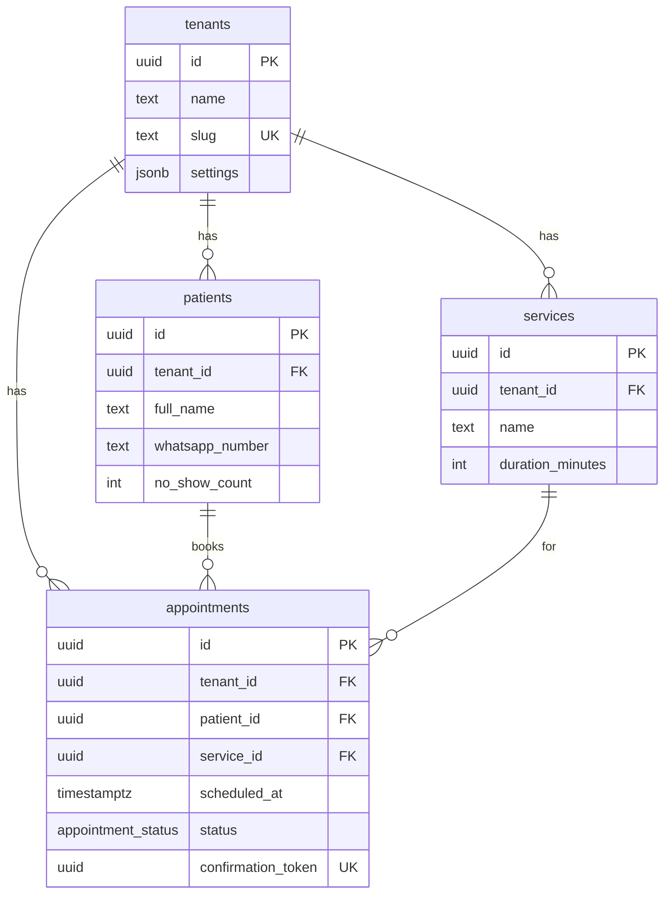
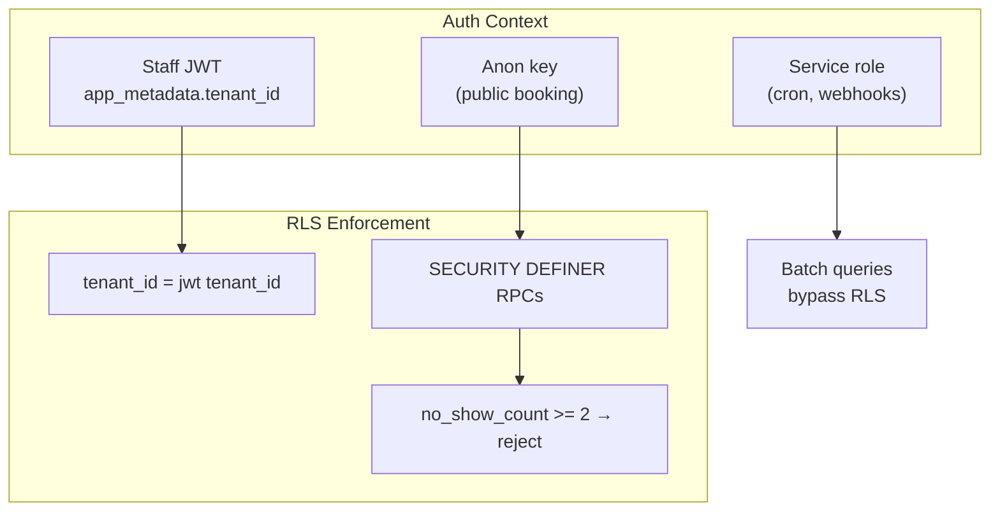
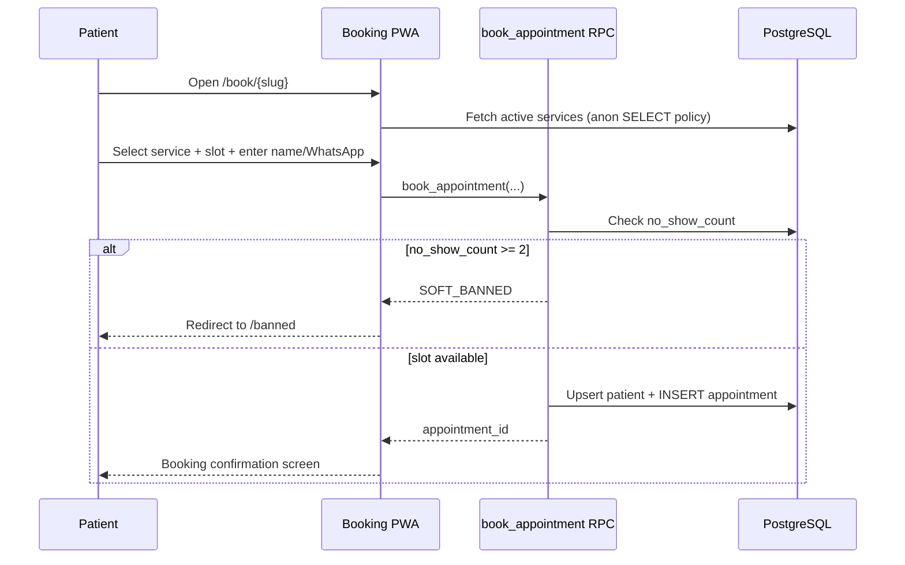
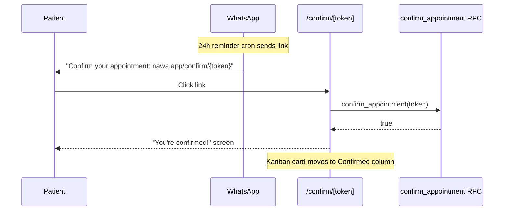
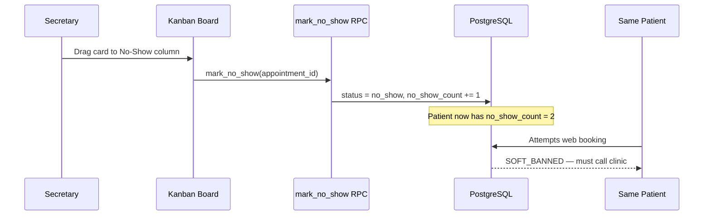

# Nawa (نواة) — System Architecture

> B2B SaaS MVP for appointment and queue management in dental and dermatology clinics (Egypt).
> Core differentiator: the **Discipline Engine** — automated reminders, smart confirmation links, and a two-strikes soft-ban for repeat no-shows.

---

## Table of Contents

1. [Tech Stack](#tech-stack)
2. [Multi-Tenancy Strategy](#multi-tenancy-strategy)
3. [Project Structure](#project-structure)
4. [Database Schema](#database-schema)
5. [Row-Level Security (RLS) Strategy](#row-level-security-rls-strategy)
6. [Key Application Flows](#key-application-flows)
7. [Performance Notes](#performance-notes)

---

## Tech Stack

| Layer | Technology |
|-------|------------|
| Framework | Next.js 14 (App Router) |
| Language | TypeScript |
| Database & Auth | Supabase (PostgreSQL) |
| Styling | Tailwind CSS |
| Animations | Framer Motion |
| Deployment | Vercel (app) + Supabase (DB/Auth/Edge) |

---

## Multi-Tenancy Strategy

**Decision: `tenant_id` column + RLS (single schema).**

Schema-per-tenant is deferred. For MVP we use a shared PostgreSQL schema where every tenant-scoped row carries a `tenant_id UUID NOT NULL REFERENCES tenants(id)` foreign key. Supabase RLS policies enforce isolation at the database layer — the application never trusts client-side tenant context alone.

**Rationale:**
- Simpler migrations and connection pooling with Supabase
- Native RLS enforcement on every query
- Straightforward path to schema-per-tenant later if a large enterprise tenant requires it

**Tenant resolution:**
- **Clinic staff:** `tenant_id` stored in Supabase Auth JWT `app_metadata.tenant_id`
- **Patient booking:** resolved via public `tenants.slug` in the URL (`/book/{slug}`)
- **Cron / webhooks:** service role key (bypasses RLS, scoped in application code)

---

## Project Structure

```
nawah/
├── app/
│   ├── (auth)/
│   │   ├── login/
│   │   └── signup/
│   ├── (dashboard)/
│   │   ├── layout.tsx          # Dark-mode shell, tenant context
│   │   └── queue/
│   │       └── page.tsx        # Kanban board (daily queue)
│   ├── (booking)/
│   │   ├── book/
│   │   │   └── [slug]/
│   │   │       └── page.tsx    # Patient PWA booking portal
│   │   └── banned/
│   │       └── page.tsx        # Soft-ban message (call clinic)
│   ├── confirm/
│   │   └── [token]/
│   │       └── page.tsx        # Smart confirmation link handler
│   ├── api/
│   │   ├── cron/
│   │   │   └── reminders/
│   │   │       └── route.ts    # 24h WhatsApp reminder batch
│   │   └── webhooks/
│   │       └── whatsapp/
│   │           └── route.ts    # Delivery status callbacks (future)
│   ├── layout.tsx
│   └── page.tsx                # Marketing / redirect
├── components/
│   ├── kanban/
│   │   ├── Board.tsx
│   │   ├── Column.tsx
│   │   └── AppointmentCard.tsx
│   ├── booking/
│   │   ├── SlotPicker.tsx
│   │   ├── ServiceSelector.tsx
│   │   └── PatientForm.tsx
│   └── ui/
│       ├── Button.tsx
│       ├── Card.tsx
│       └── ...
├── lib/
│   ├── supabase/
│   │   ├── client.ts           # Browser client
│   │   ├── server.ts           # Server Component / Route Handler client
│   │   └── middleware.ts       # Session refresh
│   ├── discipline/
│   │   ├── check-ban.ts        # no_show_count >= 2 gate
│   │   └── increment-strike.ts # Called on no_show status change
│   └── whatsapp/
│       ├── send-reminder.ts
│       └── send-confirmation.ts
├── supabase/
│   ├── migrations/
│   │   ├── 001_init_schema.sql
│   │   ├── 002_rls_policies.sql
│   │   └── 003_rpc_functions.sql
│   └── seed.sql
├── docs/
│   ├── architecture.md         # This file
│   ├── progress.md             # Engineering save-state
│   └── ui-guidelines.md        # Visual identity rules
├── public/
│   ├── manifest.json           # PWA manifest
│   └── assets/                 # Stylized illustrations only (no stock photos)
├── middleware.ts               # Auth guard for dashboard routes
├── tailwind.config.ts
├── next.config.js
└── package.json
```

---

## Database Schema

### Enums

```sql
CREATE TYPE appointment_status AS ENUM (
  'new',
  'confirmed',
  'checked_in',
  'completed',
  'no_show'
);
```

### Table: `tenants`

Root entity. One row per clinic.

| Column | Type | Constraints | Description |
|--------|------|-------------|-------------|
| `id` | `UUID` | PK, DEFAULT `gen_random_uuid()` | Tenant identifier |
| `name` | `TEXT` | NOT NULL | Clinic display name |
| `slug` | `TEXT` | NOT NULL, UNIQUE | URL slug for booking portal (`/book/{slug}`) |
| `whatsapp_business_number` | `TEXT` | | Clinic WhatsApp Business number |
| `timezone` | `TEXT` | NOT NULL, DEFAULT `'Africa/Cairo'` | IANA timezone |
| `settings` | `JSONB` | NOT NULL, DEFAULT `'{}'` | Tenant config (reminder offset hours, strike threshold, working hours) |
| `created_at` | `TIMESTAMPTZ` | NOT NULL, DEFAULT `now()` | |
| `updated_at` | `TIMESTAMPTZ` | NOT NULL, DEFAULT `now()` | |

```sql
CREATE TABLE tenants (
  id          UUID PRIMARY KEY DEFAULT gen_random_uuid(),
  name        TEXT NOT NULL,
  slug        TEXT NOT NULL UNIQUE,
  whatsapp_business_number TEXT,
  timezone    TEXT NOT NULL DEFAULT 'Africa/Cairo',
  settings    JSONB NOT NULL DEFAULT '{}',
  created_at  TIMESTAMPTZ NOT NULL DEFAULT now(),
  updated_at  TIMESTAMPTZ NOT NULL DEFAULT now()
);
```

**Example `settings` JSON:**
```json
{
  "reminder_hours_before": 24,
  "strike_threshold": 2,
  "working_hours": { "start": "09:00", "end": "17:00" },
  "slot_interval_minutes": 30
}
```

---

### Table: `services`

Procedures offered by a clinic. Scoped by `tenant_id`.

| Column | Type | Constraints | Description |
|--------|------|-------------|-------------|
| `id` | `UUID` | PK | |
| `tenant_id` | `UUID` | NOT NULL, FK → `tenants(id)` ON DELETE CASCADE | **Tenant isolation key** |
| `name` | `TEXT` | NOT NULL | e.g. "Consultation", "Follow-up", "Teeth Cleaning" |
| `duration_minutes` | `INT` | NOT NULL, DEFAULT 30 | Slot length |
| `is_active` | `BOOLEAN` | NOT NULL, DEFAULT `true` | Hidden from booking when false |
| `created_at` | `TIMESTAMPTZ` | NOT NULL, DEFAULT `now()` | |
| `updated_at` | `TIMESTAMPTZ` | NOT NULL, DEFAULT `now()` | |

```sql
CREATE TABLE services (
  id               UUID PRIMARY KEY DEFAULT gen_random_uuid(),
  tenant_id        UUID NOT NULL REFERENCES tenants(id) ON DELETE CASCADE,
  name             TEXT NOT NULL,
  duration_minutes INT NOT NULL DEFAULT 30,
  is_active        BOOLEAN NOT NULL DEFAULT true,
  created_at       TIMESTAMPTZ NOT NULL DEFAULT now(),
  updated_at       TIMESTAMPTZ NOT NULL DEFAULT now()
);

CREATE INDEX idx_services_tenant_id ON services(tenant_id);
```

---

### Table: `patients`

Patient records per tenant. The **`no_show_count`** column powers the Discipline Engine.

| Column | Type | Constraints | Description |
|--------|------|-------------|-------------|
| `id` | `UUID` | PK | |
| `tenant_id` | `UUID` | NOT NULL, FK → `tenants(id)` ON DELETE CASCADE | **Tenant isolation key** |
| `full_name` | `TEXT` | NOT NULL | Patient name (entered at booking) |
| `whatsapp_number` | `TEXT` | NOT NULL | Normalized phone (E.164 preferred) |
| `no_show_count` | `INT` | NOT NULL, DEFAULT 0 | **Strike counter — incremented on each no-show** |
| `created_at` | `TIMESTAMPTZ` | NOT NULL, DEFAULT `now()` | |
| `updated_at` | `TIMESTAMPTZ` | NOT NULL, DEFAULT `now()` | |

**Constraints:**
- `UNIQUE (tenant_id, whatsapp_number)` — one patient record per WhatsApp number per clinic
- Soft ban is enforced when `no_show_count >= 2` (checked in RPC, not a stored column)

```sql
CREATE TABLE patients (
  id               UUID PRIMARY KEY DEFAULT gen_random_uuid(),
  tenant_id        UUID NOT NULL REFERENCES tenants(id) ON DELETE CASCADE,
  full_name        TEXT NOT NULL,
  whatsapp_number  TEXT NOT NULL,
  no_show_count    INT NOT NULL DEFAULT 0 CHECK (no_show_count >= 0),
  created_at       TIMESTAMPTZ NOT NULL DEFAULT now(),
  updated_at       TIMESTAMPTZ NOT NULL DEFAULT now(),
  UNIQUE (tenant_id, whatsapp_number)
);

CREATE INDEX idx_patients_tenant_id ON patients(tenant_id);
CREATE INDEX idx_patients_tenant_whatsapp ON patients(tenant_id, whatsapp_number);
```

---

### Table: `appointments`

Core queue entity. Kanban columns map directly to `status`.

| Column | Type | Constraints | Description |
|--------|------|-------------|-------------|
| `id` | `UUID` | PK | |
| `tenant_id` | `UUID` | NOT NULL, FK → `tenants(id)` ON DELETE CASCADE | **Tenant isolation key** |
| `patient_id` | `UUID` | NOT NULL, FK → `patients(id)` | |
| `service_id` | `UUID` | NOT NULL, FK → `services(id)` | |
| `scheduled_at` | `TIMESTAMPTZ` | NOT NULL | Appointment date/time |
| `status` | `appointment_status` | NOT NULL, DEFAULT `'new'` | Kanban column |
| `confirmation_token` | `UUID` | NOT NULL, UNIQUE, DEFAULT `gen_random_uuid()` | Smart link token |
| `confirmed_at` | `TIMESTAMPTZ` | | Set when patient confirms via link |
| `checked_in_at` | `TIMESTAMPTZ` | | Set when secretary checks in |
| `completed_at` | `TIMESTAMPTZ` | | Set when appointment completes |
| `reminder_sent_at` | `TIMESTAMPTZ` | | Tracks 24h reminder dispatch |
| `created_at` | `TIMESTAMPTZ` | NOT NULL, DEFAULT `now()` | |
| `updated_at` | `TIMESTAMPTZ` | NOT NULL, DEFAULT `now()` | |

```sql
CREATE TABLE appointments (
  id                  UUID PRIMARY KEY DEFAULT gen_random_uuid(),
  tenant_id           UUID NOT NULL REFERENCES tenants(id) ON DELETE CASCADE,
  patient_id          UUID NOT NULL REFERENCES patients(id),
  service_id          UUID NOT NULL REFERENCES services(id),
  scheduled_at        TIMESTAMPTZ NOT NULL,
  status              appointment_status NOT NULL DEFAULT 'new',
  confirmation_token  UUID NOT NULL UNIQUE DEFAULT gen_random_uuid(),
  confirmed_at        TIMESTAMPTZ,
  checked_in_at       TIMESTAMPTZ,
  completed_at        TIMESTAMPTZ,
  reminder_sent_at    TIMESTAMPTZ,
  created_at          TIMESTAMPTZ NOT NULL DEFAULT now(),
  updated_at          TIMESTAMPTZ NOT NULL DEFAULT now()
);

CREATE INDEX idx_appointments_tenant_scheduled ON appointments(tenant_id, scheduled_at);
CREATE INDEX idx_appointments_tenant_status ON appointments(tenant_id, status);
CREATE INDEX idx_appointments_confirmation_token ON appointments(confirmation_token);
CREATE INDEX idx_appointments_reminder_pending ON appointments(scheduled_at)
  WHERE reminder_sent_at IS NULL AND status IN ('new', 'confirmed');
```

### Entity Relationship Diagram



### Kanban Status Mapping

| Kanban Column | DB `status` | Trigger |
|---------------|-------------|---------|
| New | `new` | Patient completes web booking |
| Confirmed | `confirmed` | Patient clicks smart confirmation link |
| Checked-in | `checked_in` | Secretary drags card or clicks action |
| Completed | `completed` | Secretary marks done |
| No-Show | `no_show` | Secretary marks no-show → increments `patients.no_show_count` |

---

## Row-Level Security (RLS) Strategy

### Principles

1. **RLS enabled on all four tables** — deny by default
2. **Never trust client-supplied `tenant_id`** — always derive from JWT or validated slug
3. **Patient-facing writes go through SECURITY DEFINER RPCs** — not direct table INSERT
4. **Service role for cron/webhooks only** — never exposed to browser

### Auth Context



### Helper Function

```sql
CREATE OR REPLACE FUNCTION auth.tenant_id()
RETURNS UUID
LANGUAGE sql
STABLE
AS $$
  SELECT (auth.jwt() -> 'app_metadata' ->> 'tenant_id')::uuid;
$$;
```

### Policy Group 1: Clinic Staff

Staff users authenticate via Supabase Auth. On signup/login, `app_metadata.tenant_id` is set.

| Table | Operation | Policy |
|-------|-----------|--------|
| `tenants` | SELECT | `id = auth.tenant_id()` |
| `tenants` | UPDATE | `id = auth.tenant_id()` |
| `services` | ALL | `tenant_id = auth.tenant_id()` |
| `patients` | ALL | `tenant_id = auth.tenant_id()` |
| `appointments` | ALL | `tenant_id = auth.tenant_id()` |

```sql
-- Example: appointments staff policy
CREATE POLICY "staff_select_appointments"
  ON appointments FOR SELECT
  TO authenticated
  USING (tenant_id = auth.tenant_id());

CREATE POLICY "staff_update_appointments"
  ON appointments FOR UPDATE
  TO authenticated
  USING (tenant_id = auth.tenant_id())
  WITH CHECK (tenant_id = auth.tenant_id());
```

### Policy Group 2: Patient Booking (Anonymous)

Direct INSERT/UPDATE on `patients` and `appointments` is **denied** for anon users. All booking goes through:

```sql
CREATE OR REPLACE FUNCTION book_appointment(
  p_tenant_slug   TEXT,
  p_full_name     TEXT,
  p_whatsapp      TEXT,
  p_service_id    UUID,
  p_scheduled_at  TIMESTAMPTZ
)
RETURNS UUID
LANGUAGE plpgsql
SECURITY DEFINER
SET search_path = public
AS $$
DECLARE
  v_tenant_id   UUID;
  v_patient_id  UUID;
  v_no_shows    INT;
  v_appointment_id UUID;
BEGIN
  -- Resolve tenant
  SELECT id INTO v_tenant_id FROM tenants WHERE slug = p_tenant_slug;
  IF v_tenant_id IS NULL THEN
    RAISE EXCEPTION 'Clinic not found';
  END IF;

  -- Upsert patient
  INSERT INTO patients (tenant_id, full_name, whatsapp_number)
  VALUES (v_tenant_id, p_full_name, p_whatsapp)
  ON CONFLICT (tenant_id, whatsapp_number)
  DO UPDATE SET full_name = EXCLUDED.full_name, updated_at = now()
  RETURNING id, no_show_count INTO v_patient_id, v_no_shows;

  -- Discipline Engine: two-strikes soft ban
  IF v_no_shows >= 2 THEN
    RAISE EXCEPTION 'SOFT_BANNED';
  END IF;

  -- Validate slot not taken (same tenant, same time)
  IF EXISTS (
    SELECT 1 FROM appointments
    WHERE tenant_id = v_tenant_id
      AND scheduled_at = p_scheduled_at
      AND status NOT IN ('no_show', 'completed')
  ) THEN
    RAISE EXCEPTION 'SLOT_TAKEN';
  END IF;

  -- Create appointment
  INSERT INTO appointments (tenant_id, patient_id, service_id, scheduled_at)
  VALUES (v_tenant_id, v_patient_id, p_service_id, p_scheduled_at)
  RETURNING id INTO v_appointment_id;

  RETURN v_appointment_id;
END;
$$;
```

### Policy Group 3: Smart Confirmation

Public route `/confirm/[token]` calls:

```sql
CREATE OR REPLACE FUNCTION confirm_appointment(p_token UUID)
RETURNS BOOLEAN
LANGUAGE plpgsql
SECURITY DEFINER
SET search_path = public
AS $$
BEGIN
  UPDATE appointments
  SET status = 'confirmed',
      confirmed_at = now(),
      updated_at = now()
  WHERE confirmation_token = p_token
    AND status = 'new'
    AND scheduled_at > now();

  RETURN FOUND;
END;
$$;
```

### Policy Group 4: No-Show Strike Increment

Triggered when staff moves card to `no_show`:

```sql
CREATE OR REPLACE FUNCTION mark_no_show(p_appointment_id UUID)
RETURNS VOID
LANGUAGE plpgsql
SECURITY DEFINER
SET search_path = public
AS $$
DECLARE
  v_patient_id UUID;
  v_tenant_id  UUID;
BEGIN
  UPDATE appointments
  SET status = 'no_show', updated_at = now()
  WHERE id = p_appointment_id
    AND tenant_id = auth.tenant_id()
  RETURNING patient_id, tenant_id INTO v_patient_id, v_tenant_id;

  IF NOT FOUND THEN
    RAISE EXCEPTION 'Appointment not found';
  END IF;

  UPDATE patients
  SET no_show_count = no_show_count + 1,
      updated_at = now()
  WHERE id = v_patient_id
    AND tenant_id = v_tenant_id;
END;
$$;
```

### Policy Group 5: Cron / Service Role

- Cron route uses `SUPABASE_SERVICE_ROLE_KEY`
- Raw SQL query for pending reminders:

```sql
SELECT a.id, a.confirmation_token, a.scheduled_at,
       p.full_name, p.whatsapp_number,
       t.name AS clinic_name, t.whatsapp_business_number
FROM appointments a
JOIN patients p ON p.id = a.patient_id
JOIN tenants t ON t.id = a.tenant_id
WHERE a.reminder_sent_at IS NULL
  AND a.status IN ('new', 'confirmed')
  AND a.scheduled_at BETWEEN now() + interval '23 hours'
                         AND now() + interval '25 hours';
```

- After sending, update `reminder_sent_at = now()` per appointment

### RLS Enablement Checklist

```sql
ALTER TABLE tenants      ENABLE ROW LEVEL SECURITY;
ALTER TABLE services     ENABLE ROW LEVEL SECURITY;
ALTER TABLE patients     ENABLE ROW LEVEL SECURITY;
ALTER TABLE appointments ENABLE ROW LEVEL SECURITY;
```

---

## Key Application Flows

### 1. Patient Booking



### 2. Smart Confirmation



### 3. Discipline Engine (Two-Strikes)



### 4. Daily Queue Load (Kanban)

Staff opens dashboard → server component calls raw SQL:

```sql
SELECT a.*, p.full_name, p.whatsapp_number, p.no_show_count, s.name AS service_name
FROM appointments a
JOIN patients p ON p.id = a.patient_id
JOIN services s ON s.id = a.service_id
WHERE a.tenant_id = auth.tenant_id()
  AND a.scheduled_at >= CURRENT_DATE
  AND a.scheduled_at < CURRENT_DATE + interval '1 day'
ORDER BY a.scheduled_at ASC;
```

---

## Performance Notes

- **Daily queue query:** Single JOIN query with tenant + date index — avoid N+1
- **Reminder batch:** Cron uses service role + indexed `reminder_pending` partial index
- **Booking slot check:** Index on `(tenant_id, scheduled_at)` prevents table scans
- **Prefer raw SQL** for complex reads via `supabase.rpc()` or Route Handler with service client
- **Realtime (optional post-MVP):** Supabase Realtime on `appointments` for live Kanban sync across devices

---

## Environment Variables

| Variable | Scope | Description |
|----------|-------|-------------|
| `NEXT_PUBLIC_SUPABASE_URL` | Public | Supabase project URL |
| `NEXT_PUBLIC_SUPABASE_ANON_KEY` | Public | Anon key for client |
| `SUPABASE_SERVICE_ROLE_KEY` | Server only | Cron, webhooks |
| `WHATSAPP_API_TOKEN` | Server only | WhatsApp Business API |
| `WHATSAPP_PHONE_NUMBER_ID` | Server only | Sender ID |
| `CRON_SECRET` | Server only | Vercel Cron auth header |

---

## Security Checklist

- [ ] RLS enabled on all tables before any data is inserted
- [ ] Service role key never exposed to client bundle
- [ ] `book_appointment` validates tenant slug server-side
- [ ] Confirmation tokens are UUID v4 (unguessable)
- [ ] Cron endpoint protected by `CRON_SECRET` header
- [ ] Rate limiting on booking RPC (post-MVP: Supabase Edge Function middleware)
