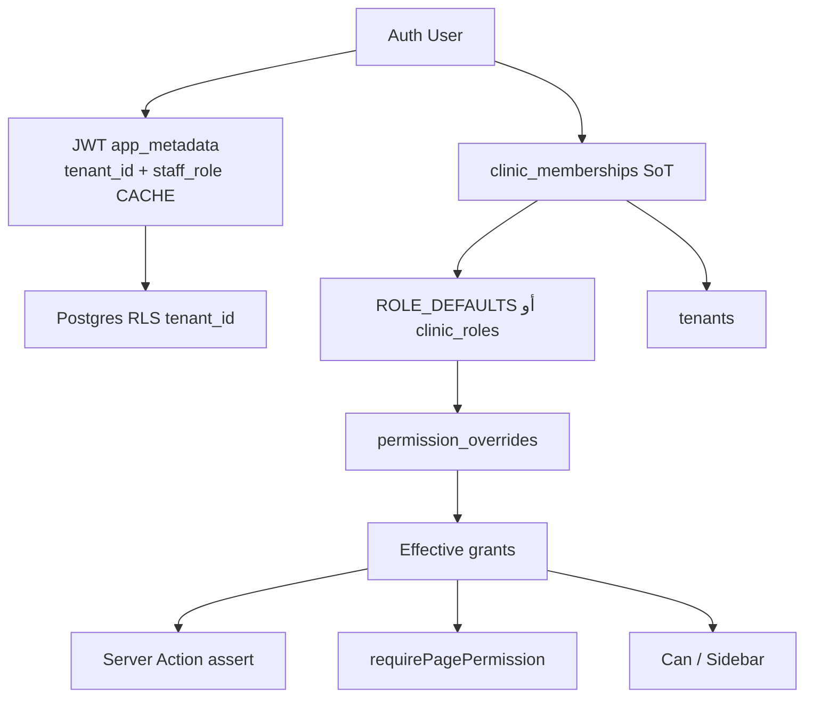

# نواة / Nawah — الدليل الشامل للمنصة (للمطورين و AI Agents)

> وثيقة مرجعية **عميقة**: المنتج + كيف يعمل السيستم من الداخل خطوة بخطوة.  
> صُممت لتُغذي AI agent بمصدر حقيقة كافٍ دون اختراع ميزات.  
> آخر تحديث: يوليو 2026  
> الاسم بالعربي: **نواة** · بالإنجليزي: **Nawah**

مستندات مكمّلة:

- [architecture.md](./architecture.md) — نظرة أقدم (قد تكون جزئياً قديمة؛ هذه الوثيقة أولى)
- [identity-memberships-update.md](./identity-memberships-update.md)
- [authorization-audit.md](./authorization-audit.md)
- [dashboard-home-structure.md](./dashboard-home-structure.md)
- [landing-page-structure.md](./landing-page-structure.md)
- [ui-guidelines.md](./ui-guidelines.md)
- [progress.md](./progress.md)

---

# الجزء أ — المنتج (ماذا يفعل النظام؟)

## أ.1 ما هي نواة؟

**نواة (Nawah)** منصة SaaS متعددة العيادات (multi-tenant) لتشغيل العيادة اليومية:

| المجال          | ماذا يفعل                                              |
| --------------- | ------------------------------------------------------ |
| حجز عام         | رابط `/{locale}/{slug}` → خدمة/موعد → تذكرة + QR       |
| Mission Control | طابور حي: خارج / انتظار / عند الطبيب + Walk-in         |
| أجندة           | مواعيد قادمة، متابعات، حظر أوقات، ساعات العمل          |
| مرضى + EHR      | دليل، عائلة، وسائط، مقارنة قبل/بعد، وصفات في الملاحظات |
| مالية           | رصيد مستحق، دفعات، لوحة إيرادات من المواعيد المكتملة   |
| مخزون           | أصناف + حد أدنى + تنبيهات                              |
| فريق            | حالات حية، دعوات، صلاحيات، أدوار مخصصة                 |
| واتساب          | قوالب `wa.me` جاهزة — **الإرسال يدوي من الطاقم**       |

**الجمهور:** أصحاب عيادات، أطباء، استقبال، تمريض — عربي أولاً + إنجليزي.

**الوعد:** هدوء تشغيلي بدون فوضى يومية.

## أ.2 ما ليس نواة (مهم للـ Agent)

- ❌ إرسال واتساب تلقائي من السيرفر
- ❌ مساعد ذكي جاهز للإنتاج (`/ai-assistant` = Coming soon)
- ❌ تسويق آلي جاهز (`/marketing` = Coming soon)
- ❌ RLS على مستوى كل صلاحية (الصلاحيات App-layer)
- ❌ جدول وصفات منفصل (الوصفة تُلحق في `patients.notes`)
- ❌ Server Action جاهز لـ «زيادة المديونية» من فاتورة خدمة (الدفعات تنقص الرصيد فقط)

## أ.3 التسعير (من الواجهة — أكّد من الرسائل قبل الحملات)

| خطة    | ID         | تقريباً                             |
| ------ | ---------- | ----------------------------------- |
| تجربة  | `free_6mo` | 0 ج.م / 6 أشهر                      |
| مدفوعة | `paid_6mo` | ~3000 ج.م / 6 أشهر + إعداد ~500 ج.م |

التسجيل: `/register?plan=…` → يكتب `tenant_subscriptions`.

## أ.4 فصل الهوية في الواجهة

| المسار                       | المعنى                                         |
| ---------------------------- | ---------------------------------------------- |
| `/dashboard/settings/clinic` | هوية العيادة العامة (صفحة الحجز)               |
| `/dashboard/account`         | أنت كشخص: الاسم/الدور/العيادة + ثيم + باسورد   |
| `/dashboard/settings/roles`  | مصفوفة الأدوار (`team.roles`)                  |
| `/dashboard/staff`           | عمليات الفريق (بدون بطاقة الشخص المسجّل دخوله) |

---

# الجزء ب — كيف يشتغل السيستم من الداخل

## ب.1 مخطط المفاهيم



**قاعدة ذهبية:** JWT = كاش. مصدر الحقيقة للدور = `clinic_memberships`. مصدر الحقيقة لعزل البيانات = `tenant_id` في الصفوف + RLS.

## ب.2 الـ Stack التشغيلي

| طبقة       | تقنية                                         | ملاحظة                            |
| ---------- | --------------------------------------------- | --------------------------------- |
| App        | Next.js 14 App Router, RSC + Server Actions   | الطفرات في `src/actions/`         |
| UI         | React 18, Tailwind, Framer Motion, Lucide     | عربي RTL افتراضي                  |
| Auth/DB    | Supabase Auth + Postgres + Storage + Realtime | مفاتيح anon + service role        |
| i18n       | next-intl                                     | `ar` default, `en`, prefix دائماً |
| Validation | Zod + RHF                                     | على النماذج والحجز                |
| Deploy     | Node ≥18, Passenger اختياري (`server.js`)     |                                   |

ملفات محورية:

- `src/middleware.ts` — جلسة + لغة + بوابة داشبورد
- `src/utils/supabase/auth.ts` — `createAuthenticatedClient`, `resolveTenantId`, فحص الاشتراك
- `src/lib/auth/membership.ts` — عضويات + مزامنة JWT
- `src/lib/auth/permissions.ts` — كتالوج + ROLE_DEFAULTS
- `src/lib/auth/staffPermissions.ts` — حل الصلاحيات الفعلية

---

## ب.3 دورة الطلب HTTP (Request lifecycle)

1. المستخدم يزور مساراً تحت `/(ar|en)/…` أو `/`
2. **Middleware** (`src/middleware.ts`):
   - `/` → redirect `/ar`
   - `/super-admin*` يتجاوز intl
   - باقي المسارات تمر على next-intl
   - يبني Supabase SSR من الكوكيز ويستدعي **`getUser()`** (ليس `getSession()` وحده)
   - يقرأ `user.app_metadata.tenant_id`
   - لو جلسة عيادة على `/` أو login/register → داشبورد
   - لو `/dashboard*` بدون يوزر → login
   - لو داشبورد بدون `tenant_id` → login `?error=missing_tenant`
3. صفحات الداشبورد غالباً Server Components تجلب البيانات عبر queries
4. الطفرات = Server Actions تستدعي `createAuthenticatedClient()` ثم `requirePermission(...)` ثم Supabase
5. Realtime على المتصفح يشترك في قنوات مفلترة بـ `tenant_id`

---

## ب.4 المصادقة والجلسة بالتفصيل

### إنشاء عميل مصادق

`createAuthenticatedClient()` في `src/utils/supabase/auth.ts`:

1. عميل كوكيز
2. `getUser()`
3. إن وُجد مستخدم: `assertTenantIsActive(tenantId)` عبر **service role**:
   - `tenants.is_active !== false`
   - اشتراك نشط عبر `isSubscriptionRowActive`
4. بيئة تطوير: قد يعمل auto-login عبر `SUPABASE_DEV_USER_*`
5. `resolveTenantId()` من JWT أو يرمي خطأ

### Claims في JWT (كاش)

تُكتب عبر `syncMembershipToJwt` (`membership.ts`):

- `tenant_id`
- `staff_role`
- `staff_profile_id`
- `membership_id`
- مع الحفاظ على `provider` / `providers`

### تسجيل الدخول

`loginClinic`:

1. `signInWithPassword`
2. `ensureClinicOwnerAccess` — ترقية حسابات قديمة بلا دور إلى owner + ضمان staff + membership
3. `syncUserClinicMembershipsFromStaff`
4. `refreshSession()` حتى يظهر الـ JWT المحدّث فوراً
5. redirect `/{locale}/dashboard`

### التسجيل

`registerClinic` (service role):

1. `auth.admin.createUser`
2. slug فريد → insert `tenants`
3. `createTenantSubscription`
4. JWT owner + insert `staff_profiles` + `upsertClinicMembership` + sync JWT
5. `signInWithPassword` على كوكيز المتصفح
6. عند الفشل: حذف المستخدم المُنشأ

### تبديل العيادة

`switchClinic`:

1. التحقق أن المستخدم عضو في الهدف
2. العضوية `active` والعيادة نشطة
3. `syncMembershipToJwt` للعيادة الجديدة
4. `refreshSession` → dashboard

### كلمة المرور / الخروج

- `changeOwnPassword`: إعادة التحقق بالباسورد الحالي ثم `updateUser`
- `logoutClinic`: `signOut` → login

---

## ب.5 تعدد العيادات و RLS

### الجداول المحورية

| جدول                                       | دور                                                  |
| ------------------------------------------ | ---------------------------------------------------- |
| `tenants`                                  | العيادة (اسم، slug، براند، `is_active`…)             |
| `clinic_memberships`                       | User×Clinic: role, status, overrides, custom_role_id |
| `staff_profiles`                           | ملف تشغيلي داخل العيادة (اسم، availability، غرفة…)   |
| `clinic_roles` / `clinic_role_permissions` | أدوار مخصصة ومصفوفة صلاحيات                          |
| `tenant_subscriptions`                     | الاشتراك                                             |

### دالة RLS

```sql
-- من 001_initial_schema.sql
get_tenant_id() → uuid من auth.jwt()→app_metadata→tenant_id
```

السياسات العامة: `tenant_id = get_tenant_id()`.

استثناءات multi-clinic (029):

- العضو يرى عضوياته عبر العيادات (`user_id = auth.uid()`)
- يرى أسماء العيادات التي هو عضو فيها

### الحجز العام كيف يتجاوز RLS؟

لا يوجد مسار anon يكتب في الجداول بحرية.  
Server Actions العامة تستخدم **`createServiceRoleClient()`** وتُقيّد يدوياً بالـ slug / tenant / ملكية الخدمة.  
**ممنوع** تمرير service role للمتصفح.

---

## ب.6 خوارزمية الصلاحيات (RBAC) خطوة بخطوة

ملفات: `permissions.ts` · `clinicRoles.ts` · `staffPermissions.ts`

1. `createAuthenticatedClient()` + `getUser()`
2. `resolveActiveMembership` على `(tenant_id من JWT, user.id)`
3. إن `status === suspended` → لا صلاحيات
4. **المجموعة الأساسية (base):**
   - إن وُجد `custom_role_id` → كل صفوف `clinic_role_permissions` لهذا الدور
   - وإلا إن وُجد صف `clinic_roles` لنفس مفتاح الدور وفيه صلاحيات محفوظة → استخدمها
   - وإلا → `ROLE_DEFAULTS[normalizeTeamRole(role)]`
5. اقرأ `permission_overrides` من العضوية `{ grant[], deny[] }`
6. `applyPermissionOverrides` — إضافة grant وحذف deny (مفاتيح الكتالوج فقط)
7. بدون عضوية: سقوط إلى JWT `staff_role` + ROLE_DEFAULTS فقط
8. التطبيق:
   - Actions: `requirePermission` / `assertPermission`
   - Pages: `requirePagePermission` → `AccessDenied` (403)
   - Sidebar: `permissionForDashboardPath`
   - UI: `PermissionProvider` + `<Can>` / `usePermission`

**أدوار نظامية:**  
owner · admin · manager · doctor · receptionist · nurse · assistant · lab · cashier · intern

**أمثلة مفاتيح:**  
`queue.manage` · `walkin.create` · `patients.delete` · `ehr.prescribe` · `finance.record` · `clinic.manage` · `team.roles` · `booking.link`

**تحذير أمني:** نسيان `requirePermission` على Action = ثغرة. `<Can>` ليس أماناً.

---

## ب.7 محرك المواعيد والحجز

### مصادر الوقت

كل شيء بتوقيت **القاهرة** (`src/lib/datetime/cairo.ts`) — لا تستخدم تاريخ سيرفر محلي لأي يوم عمل.

### توليد المواعيد المتاحة

`getSlotAvailability` / `getAvailableSlots` (`src/actions/slots.ts`):

1. اقرأ `working_hours` ليوم الأسبوع في القاهرة
2. نوافذ العمل من `shifts[]` أو `start_time`/`end_time`
3. شبكة زمن بخطوة = مدة الخدمة (`generateAvailableSlotTimes`)
4. استبعد التعارض مع:
   - مواعيد بحالات تحجز السلوت
   - `blocked_slots`
5. اليوم الحالي: استبعد الأوقات الماضية

### حالات تحجز السلوت (طبقة التطبيق)

من `slotBlocking.ts`: عادة `confirmed` · `checked_in` · `in_session`  
(ملاحظة: طبقة DB/GiST قد تعتبر `pending` أيضاً شاغلاً — راعِ الفرق عند التغيير)

### ثلاثة مسارات حجز

| المسار  | الملف                | من؟           | ملاحظات                                                                                           |
| ------- | -------------------- | ------------- | ------------------------------------------------------------------------------------------------- |
| عام     | `bookAppointment.ts` | مريض عبر slug | service role + RPC `book_appointment_atomic` + soft-ban إن `no_show_count >= 2` + تذكرة موقعة     |
| داخلي   | `internalBooking.ts` | طاقم          | يحتاج `appointments.manage`                                                                       |
| Walk-in | `addWalkIn.ts`       | استقبال       | `walkin.create` · حالة `checked_in` · مصدر `walk_in` · **لا يمر** على نفس فحص السلوت الذري دائماً |

آلة حالات الطابور (`queueStateMachine.ts`) تقريباً:

`pending → confirmed → checked_in → in_session → completed`  
(+ `no_show` / `canceled`)

`updateAppointmentStatus` يحدّث طوابع زمنية (`checked_in_at`, `session_started_at`, `completed_at`) ويزيد `no_show_count` عند الغياب.

---

## ب.8 Mission Control (شاشة اليوم)

### المناطق ↔ الحالات

| منطقة الشاشة | حالات الموعد           |
| ------------ | ---------------------- |
| Outside      | `pending`, `confirmed` |
| Waiting      | `checked_in`           |
| Doctor       | `in_session`           |

Selectors: `src/lib/dashboard/missionControlSelectors.ts`  
Actions: `missionControl.ts` — `callNextPatient`, `startSession`, `completeSession`, `moveAppointmentToZone`, `markEmergency`, …  
UI: `MissionControlShell` + realtime على `appointments`.

---

## ب.9 المرضى والسجل الطبي

### نموذج المريض

جدول `patients`: اسم، هاتف، ملاحظات، أرشفة، `total_balance_due`، `no_show_count`، `parent_id` / `relationship_type` للعائلة.

- المريض الرئيسي: `parent_id IS NULL`
- التابعين يشاركون الهاتف مع علاقة
- عند البحث بالحجز العام: ابحث الماستر أولاً بـ `.is("parent_id", null)`

### الوسائط (Visual EHR)

- جدول `patient_media` · Bucket `clinic_ehr`
- مسار التخزين: `{tenantId}/{patientId}/{uuid}.ext`
- وسوم: `before` | `after` | `x-ray` | `general`
- صلاحية الكتابة: `ehr.write`

### الوصفات

- **لا يوجد** جدول prescriptions
- `savePatientPrescription` (`ehr.prescribe`) يلحق نصاً منسقاً داخل `patients.notes`
- UI: `PrescriptionBuilder` + كتالوج أدوية محلي

### Theater Mode

وضع واجهة ملء الشاشة في العميل فقط (`TheaterModeContext`) — ليس وضع DB.

---

## ب.10 المالية

| مفهوم           | كيف يعمل                                                                          |
| --------------- | --------------------------------------------------------------------------------- |
| رصيد مستحق      | `patients.total_balance_due`                                                      |
| دفعة            | insert في `patient_payments` + إنقاص الرصيد (`finance.record`) — لا تتجاوز الرصيد |
| إيرادات اللوحة  | مواعيد `completed` × `services.price_egp`                                         |
| «خسائر» تقريبية | مواعيد `no_show` × السعر                                                          |
| مديونون         | مرضى `total_balance_due > 0`                                                      |

**مهم:** لا يوجد حالياً Action قياسي «يُحمّل» الرصيد من خدمة مكتملة تلقائياً في كل المسارات — الدفعات تُنقص ما هو موجود في الحقل.

---

## ب.11 المخزون والإشعارات

- `inventory_items`: كمية + `min_threshold` + تكلفة
- تنبيه منخفض عندما `quantity <= min_threshold`
- عاجل تقريباً عندما الكمية ≤ نصف الحد (بحد أدنى منطقي في كود الإشعارات)
- صلاحية الإدارة: `inventory.manage`

---

## ب.12 عمليات الفريق

| جدول/مفهوم           | المعنى                                                     |
| -------------------- | ---------------------------------------------------------- |
| `staff_profiles`     | قائمة الفريق التشغيلية والحالة الحية                       |
| `clinic_memberships` | التفويض والصلاحيات                                         |
| `staff_invites`      | دعوات                                                      |
| Realtime             | `appointments` + `staff_profiles` عبر `useTeamOpsRealtime` |

`availability`: `available` | `busy` | `break` | `offline`  
الشخص المسجّل دخوله يُستبعد من قائمة Team Ops في الـ snapshot (يُدار من `/account`).

---

## ب.13 الاشتراك — أين يُفحص؟

| المكان                                | السلوك                                               |
| ------------------------------------- | ---------------------------------------------------- |
| داخل `createAuthenticatedClient`      | يمنع استعلامات الداشبورد إن العيادة/الاشتراك غير نشط |
| الحجز العام `fetchTenantBySlugPublic` | يعيد null إن الاشتراك غير صالح → لا بوابة حجز        |
| `isSubscriptionRowActive`             | صف ناقص قد يُعامل كنشط (توافق قديم) — انتبه          |

---

## ب.14 Realtime — القنوات

| قناة                         | جدول                          | مستهلك                |
| ---------------------------- | ----------------------------- | --------------------- |
| `appointments:tenant:{id}`   | appointments                  | Mission Control       |
| `booking-notifications:{id}` | appointments INSERT           | توست/صوت حجوزات جديدة |
| `team-ops:tenant:{id}`       | appointments + staff_profiles | Team Ops              |

الفلتر دائماً: `tenant_id=eq.{id}`.

---

## ب.15 i18n

- Locales: `ar`, `en` — default `ar` — `localePrefix: always`
- اتجاه: ar=rtl, en=ltr
- الرسائل: `src/messages/ar.json`, `en.json`
- مفاتيح الصلاحيات في الترجمة متداخلة (`permissions.settings.view`) لأن next-intl يفسر النقطة كمسار

---

## ب.16 هيكل المسارات (مختصر تشغيلي)

**عام:** `/` · `/login` · `/register` · `/{slug}` · `/{slug}/success`  
**داشبورد:** Mission Control · upcoming · patients · services · inventory · staff · analytics · financials · recalls · settings\* · account · marketing/ai (soon)  
**منصة:** `/super-admin`

---

## ب.17 هيكل المجلدات

```
src/app/                 المسارات (locale, auth, dashboard, slug, super-admin)
src/actions/             Server Actions = حدود الأمان للأعمال
src/components/          UI حسب المجال
src/lib/auth/            membership, permissions, roles, staffPermissions
src/lib/queries/         قراءة مجمّعة للصفحات
src/lib/scheduling/      slots, conflicts, cairo-aware helpers
src/lib/dashboard/       Mission Control selectors + queue machine
src/lib/whatsapp/        قوالب wa.me فقط
src/messages/            ترجمة
src/middleware.ts        بوابة الجلسة واللغة
supabase/migrations/     001 + 022–030 (+ ملفات قديمة خارج المجلد أحياناً)
docs/                    هذه الوثائق
```

---

## ب.18 جداول DB مهمة

**Typed غالباً:**  
tenants · services · patients · patient_payments · appointments · patient_media · working_hours · blocked_slots · subscription_plans · tenant_subscriptions · inventory_items

**إضافية من Migrations:**  
staff_profiles · clinic_rooms · appointment_invoices · operational_tasks · staff_invites · clinic_memberships · clinic_roles · clinic_role_permissions

**Storage buckets:** براند العيادة · `clinic_ehr` للوسائط الطبية

---

## ب.19 فخاخ شائعة لأي AI Agent يعدّل الكود

1. لا «تصلح الدور» من JWT فقط — عدّل `clinic_memberships` ثم `syncMembershipToJwt`.
2. كل mutation حساسة تحتاج `requirePermission` — UI gating غير كافٍ.
3. لا تمرّر service role للكلاينت.
4. راعِ فرق `pending` بين محرك السلوت وقيود DB.
5. Walk-in قد يصطدم بقيود التعارض إن طابقت نفس الدقيقة.
6. العائلة: ابحث الماستر بـ `parent_id IS NULL`.
7. Soft-ban الحجوزات العامة عند `no_show_count >= 2`.
8. الوصفات في `notes` — لا تفترض جدولاً جديداً بلا migration.
9. الدفعات تنقص الرصيد؛ الإيراد في اللوحة من المواعيد المكتملة × السعر.
10. صف اشتراك مفقود قد يُعتبر نشطاً.
11. التواريخ = القاهرة دائماً.
12. عيادة ≠ حسابي ≠ عضوية.
13. واتساب = روابط فقط.
14. `docs/architecture.md` قديم جزئياً — فضّل هذه الوثيقة + الكود.
15. مجلدات SQL مزدوجة أحياناً (`supabase/*.sql` و `migrations/`) — تأكد ما طُبّق فعلياً على المشروع.

---

## ب.20 قائمة تحقق لمطور جديد

1. طبّق migrations حتى `030` (وما يلزم من الأقدم)
2. اضبط env: URL + anon + service role
3. `npm run dev` → `/ar`
4. سجّل عيادة أو `seed:dev-user`
5. اقرأ قسم ب.6 و ب.19 قبل أي Action جديد
6. بعد تغيير صلاحيات: اختبر دور receptionist مقابل owner

---

# الجزء ج — Prompts لـ AI Agent (انسخ والصق)

**تعليمات عامة للـ Agent قبل الكتابة:**

1. اعتبر هذه الوثيقة كاملة مصدر الحقيقة.
2. لا تخترع ميزات من قسم «ما ليس نواة».
3. فرّق دائماً بين: منتج للمستخدم النهائي vs تفاصيل تقنية للمبرمجين.
4. إن ذُكر سعر، انصح بالتحقق من `landing.pricing` في ملفات الترجمة.

---

## Prompt A — بوست تسويقي للاشتراك / التجربة

```text
أنت كاتب محتوى تسويقي لعيادات في مصر والعالم العربي.

اقرأ وافهم جيداً دليل منصة «نواة / Nawah» (الوثيقة الكاملة المرفقة أو الملصقة في السياق)، خصوصاً:
- الجزء أ (المنتج، الجمهور، الوعد، ما ليس نواة، التسعير، فصل الهوية)
- رحلات المستخدم العملية: حجز عام، Mission Control، أجندة، مرضى/EHR، مالية، مخزون، فريق، واتساب اليدوي
- أن المنصة عربي أولاً + إنجليزي، multi-tenant، أدوار وصلاحيات

اكتب محتوى تسويقي بالاعتماد فقط على ما في الدليل. ممنوع الاختراع.

قيود صدق إلزامية:
- لا تقل إن واتساب يُرسل تلقائياً من نواة (القوالب جاهزة والطاقم يرسل من واتساب)
- لا تقل إن المساعد الذكي أو التسويق الآلي جاهزان (Coming soon)
- لا تعد بـ EMR مستشفى ضخم أو فروع هرمية معقدة غير مذكورة
- لا تخلط «إعدادات العيادة» مع «حسابي الشخصي»

المطلوب:
1) نسختان لغويتان: عربية مهنية قريبة من ذوق السوق المصري، وإنجليزية قصيرة واضحة.
2) لكل لغة: هوك → ألم يوم العيادة → حل نواة → 5–7 فوائد ملموسة من الدليل → CTA للتسجيل/التجربة المجانية 6 أشهر وللخطة المدفوعة دون مبالغة.
3) فورمات: (أ) بوست قصير ≤1200 حرف لـ IG/LinkedIn (ب) بوست أطول لفيسبوك/كاروسيل نصي.
4) 3 عناوين A/B + 8–12 هاشتاج متزن.
5) نبرة هادئة واثقة (تشغيل عيادة بهدوء) وليست صراخ تخفيضات.
6) جملة واحدة توضح أن الصلاحيات متعددة الأدوار تفيد العيادة متعددة الموظفين (بدون تفاصيل RBAC تقنية).

أخرج النتيجة بعناوين جاهزة للنسخ والنشر.
```

---

## Prompt B — بوست/مقال تقني للمبرمجين (كيف بُنيت نواة)

```text
أنت مهندس يكتب للمطورين (LinkedIn / Dev.to / X).

ادرس دليل «نواة / Nawah» الكامل في السياق، وركّز على الجزء ب (كيف يشتغل السيستم):
- Request lifecycle + middleware (getUser، tenant_id، بوابات الداشبورد)
- JWT ككاش مقابل clinic_memberships كمصدر حقيقة
- RLS عبر get_tenant_id() مقابل Service Role للحجز العام
- خوارزمية RBAC (ROLE_DEFAULTS → clinic_roles → overrides → requirePermission / 403 / Can)
- محرك السلوتس (القاهرة، working_hours، تعارضات، book_appointment_atomic، walk-in vs public vs internal)
- Mission Control (zones↔statuses + realtime)
- Patients/family/media/prescriptions-in-notes
- Payments vs financial overview (completed × price)
- Realtime channels
- فخاخ المطورين في ب.19

اكتب محتوى تقني دقيق. ممنوع اختراع Redis/Kafka/microservices غير موجودة.
كن صريحاً: «tenant RLS + app-layer RBAC» وليس permission-level RLS كامل.
اذكر أن WhatsApp = deep links، وأن AI/Marketing placeholders إن لزم السياق.

المطلوب:
1) عنوان تقني جذاب + مقدمة: من فوضى عيادة إلى multi-tenant operations OS.
2) مخطط mermaid أو ASCII: User → Membership → Grants → Action؛ و Tenant → RLS.
3) أقسام مقترحة:
   - لماذا Next.js 14 App Router + Supabase
   - Tenancy و JWT cache
   - Server Actions كحدود تفويض
   - Booking engine وفرق المسارات الثلاثة
   - Live floor (Mission Control) + Realtime
   - دروس قاسية (من قسم الفخاخ)
4) 5 قرارات تصميمية «ما نجح / ما نحذر منه».
5) مخرجات مزدوجة:
   (أ) ثريد X من 10–14 تغريدة مرقّمة
   (ب) مقال 900–1400 كلمة بعناوين فرعية
6) نسختان: عربية تقنية فصحى (مصطلحات إنجليزية بين قوسين) + إنجليزي كامل.

CTA أخير للمطورين المهتمين بـ multi-tenant SaaS / healthtech / RTL products.
```

---

## ملاحظات استخدام الـ Prompts

1. الصق **الوثيقة كاملة** (أو الجزء أ+ب على الأقل) مع الـ Prompt في نفس الرسالة للـ Agent.
2. بعد أي تغيير منتج كبير: حدّث الجزء أ/ب أولاً ثم أعد توليد البوستات.
3. راجع المخرجات ضد «ما ليس نواة» وقسم ب.19 قبل النشر.
4. للأرقام المالية في الحملات: أكّد من `src/messages/ar.json` و `en.json` تحت `landing.pricing`.
