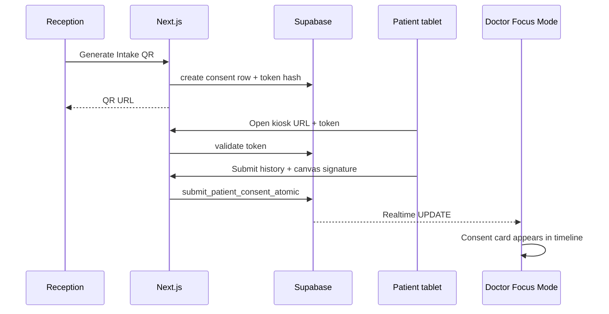

# Nawa (نواة) — Phase 2 Architectural Roadmap

> Status: **Planning only** — no implementation yet  
> Stack: Next.js 14 App Router · Supabase PostgreSQL / Auth / Storage / Realtime · `next-intl`  
> Last updated: 2026-07-17

This document is the source of truth for three Phase 2 product pillars. It defines schema, routes, UI composition, and backend contracts so implementation can proceed without structural drift.

---

## Goals & Non-Goals

### Goals

1. Let one WhatsApp/phone book for multiple family members without violating `UNIQUE (tenant_id, phone_number)`.
2. Give the doctor a distraction-free clinical workspace that opens only for `in_session` appointments.
3. Digitize waiting-room intake and consent so forms sync into the clinical session in real time.

### Non-Goals (Phase 2)

- Full HIPAA/GDPR certification workstream (document risks; ship tenant RLS first).
- WhatsApp Business API automation (still `wa.me` deep links).
- Multi-doctor staff RBAC beyond current revenue gate.
- Standalone `prescriptions` table (Focus Mode continues to reuse / extend the e-Prescription builder; structured RX table may land in Phase 2.1).

### Design Constraints (must preserve)

- Multi-tenancy: every operational row carries `tenant_id`; RLS remains deny-by-default.
- Public writes use **server-validated** tokens / SECURITY DEFINER RPCs — never trust client `tenant_id`.
- Soft-ban and booking concurrency (`book_appointment_atomic` + exclusion constraint) remain authoritative for public booking.
- Dashboard stays dark; patient/kiosk surfaces stay mobile-first and light where readability requires it.
- Arabic-first (`ar` default) with full `en` parity in message catalogs.

---

## Feature 1 — Family & Dependents Accounts  
### الحسابات العائلية

### 1.1 Problem

Today `patients` enforces `UNIQUE (tenant_id, phone_number)`. A mother booking three children collides on the same phone. Clinics work around this with fake numbers or duplicate CRM noise.

### 1.2 Concept

- **Master patient:** owns the phone number (booking contact).
- **Dependent patient:** row with `parent_id → patients.id`, may share contact via the master; does **not** need a unique phone of its own.
- Appointments always point at the **patient being treated** (`patient_id` = master or dependent). Contact/WhatsApp actions resolve through the master phone when the dependent has none.

### 1.3 Database Schema

**Migration (planned):** `supabase/migrations/023_family_dependents.sql`

```sql
-- Relationship vocabulary (text + CHECK for MVP; enum optional later)
ALTER TABLE public.patients
  ADD COLUMN IF NOT EXISTS parent_id uuid
    REFERENCES public.patients (id) ON DELETE SET NULL,
  ADD COLUMN IF NOT EXISTS relationship_type text;

ALTER TABLE public.patients
  ADD CONSTRAINT patients_relationship_type_check
  CHECK (
    relationship_type IS NULL
    OR relationship_type IN (
      'self', 'child', 'spouse', 'parent', 'sibling', 'other'
    )
  );

-- A dependent must not be its own parent; masters have parent_id IS NULL
ALTER TABLE public.patients
  ADD CONSTRAINT patients_parent_not_self
  CHECK (parent_id IS DISTINCT FROM id);

-- Only one level of dependents for MVP (no trees of trees)
CREATE OR REPLACE FUNCTION public.patients_assert_parent_is_master()
RETURNS trigger
LANGUAGE plpgsql
AS $$
BEGIN
  IF NEW.parent_id IS NULL THEN
    RETURN NEW;
  END IF;
  IF EXISTS (
    SELECT 1 FROM public.patients p
    WHERE p.id = NEW.parent_id AND p.parent_id IS NOT NULL
  ) THEN
    RAISE EXCEPTION 'DEPENDENT_NESTING_FORBIDDEN';
  END IF;
  RETURN NEW;
END;
$$;

CREATE TRIGGER trg_patients_parent_is_master
  BEFORE INSERT OR UPDATE OF parent_id ON public.patients
  FOR EACH ROW EXECUTE FUNCTION public.patients_assert_parent_is_master();

CREATE INDEX IF NOT EXISTS idx_patients_tenant_parent
  ON public.patients (tenant_id, parent_id)
  WHERE parent_id IS NOT NULL;
```

**Phone uniqueness strategy (required):**

| Role | `phone_number` | Constraint behavior |
|------|----------------|---------------------|
| Master | Real E.164 / clinic-normalized phone | Remains unique per tenant |
| Dependent | Prefer **nullable** phone, or synthetic internal token | Must **not** compete with master's unique phone |

Recommended approach:

```sql
-- Allow dependents without a real phone
ALTER TABLE public.patients
  ALTER COLUMN phone_number DROP NOT NULL;

-- Partial unique index: uniqueness only for rows that have a phone
ALTER TABLE public.patients
  DROP CONSTRAINT IF EXISTS patients_tenant_phone_unique;

CREATE UNIQUE INDEX IF NOT EXISTS patients_tenant_phone_unique_idx
  ON public.patients (tenant_id, phone_number)
  WHERE phone_number IS NOT NULL;
```

**Soft-ban inheritance:** booking checks `no_show_count` on the **master** (contact owner) and optionally on the dependent being booked. Document product rule: ban is contact-level for MVP (`master.no_show_count >= 2` blocks online booking for the whole household).

**RLS:** existing `patients_*_tenant` policies cover new columns; no anon direct writes.

### 1.4 Backend Logic

| Action / query | Responsibility |
|----------------|----------------|
| `bookAppointment` / `book_appointment_atomic` | Accept optional `dependentId` **or** `dependentPayload { name, relationship_type }`. Resolve master by phone+tenant. Upsert dependent under `parent_id`. Insert appointment on dependent (or master if “for myself”). |
| `listPatientFamily(patientId)` | Returns master + dependents (normalize if called with a dependent id). |
| `createDependent` / `updateDependent` / `unlinkDependent` | Staff CRM mutations; tenant-scoped; prevent cycles. |
| WhatsApp helpers | Resolve display phone: `patient.phone_number ?? parent.phone_number`. |
| Discipline / soft-ban | Evaluate master contact; surface clinic phone as today. |

**Booking payload (additive):**

```ts
type BookAppointmentInputV2 = BookAppointmentInput & {
  bookingFor: "self" | "dependent";
  dependentId?: string;
  dependent?: {
    name: string;
    relationshipType: "child" | "spouse" | "parent" | "sibling" | "other";
  };
};
```

### 1.5 UI / UX Structure

**Public booking (`/{locale}/{slug}`)**

1. After service + slot selection, ask:  
   **«هل الحجز لك أم لشخص آخر؟»** / “Is this booking for you or someone else?”
2. **Self:** existing name + WhatsApp form (name becomes master profile name).
3. **Dependent:**
   - WhatsApp of the responsible adult (master).
   - Dependent full name + relationship chips.
   - Optional: if master phone known and has dependents, picker to choose existing child.
4. Success ticket shows **patient treated** + **booked by** contact.

**CRM — Patient detail (`/dashboard/patients/[id]`)**

- New section **Family Tree** in Medical Record tab (or header strip):
  - Master card + linked dependents.
  - Quick switch: navigate to `/dashboard/patients/{memberId}` without losing clinic context.
  - Actions: add dependent, edit relationship, open EHR of member.
- Appointments list remains per treated patient; show badge «حجز بواسطة {master}» when `parent_id` is set.

**i18n:** new keys under `booking.family.*` and `patients.family.*` in `ar.json` / `en.json`.

### 1.6 Acceptance Criteria

- [ ] Two dependents can share one master phone without unique violations.
- [ ] Soft-ban on master blocks household online booking.
- [ ] CRM Family Tree lists all members; switch preserves tenant isolation.
- [ ] Walk-in and agenda scheduling can attach existing dependents.

---

## Feature 2 — Doctor Focus Mode  
### وضع التركيز السريري

### 2.1 Problem

Mission Control is receptionist-dense. During `in_session`, the doctor needs a full-screen clinical surface: history + imaging on one side, live documentation + Rx on the other — without sidebar chrome.

### 2.2 Concept

- Activates **only** when `appointments.status = 'in_session'`.
- Route is doctor-facing; receptionist continues on Mission Control.
- Entry points: pulsing room on Clinic Radar → Focus Mode; optional deep link from queue card.

### 2.3 Database Schema

**No mandatory new tables for MVP Focus Mode.** Reuse:

| Existing asset | Use in Focus Mode |
|----------------|-------------------|
| `appointments.doctor_notes` | SOAP / session notes persistence |
| `patients.notes` | Long-term clinical notes + Phase-1 Rx text |
| `patient_media` + `clinic_ehr` | Timeline / X-rays |
| `patient_payments` / balance | Read-only financial chip (role-gated) |
| Phase 2 Feature 3 `patient_consents` | Consent panel once shipped |

**Optional later (Phase 2.1):**

```sql
-- Structured clinical note if doctor_notes outgrows free text
ALTER TABLE public.appointments
  ADD COLUMN IF NOT EXISTS soap_json jsonb;
```

### 2.4 Routes & Layout

**New route:**

```text
src/app/[locale]/dashboard/session/[appointmentId]/page.tsx
```

**Layout rules:**

- Nested under `dashboard` for auth/tenant middleware, but use a **session-specific layout** that **hides** `Sidebar` / collapsible nav and minimizes topbar (clinic name + end-session only).
- Suggested layout file:  
  `src/app/[locale]/dashboard/session/layout.tsx` → full viewport, no receptionist chrome.

```text
┌──────────────────────────────────────────────────────────────┐
│ Focus Topbar: patient · service · timer · End session        │
├────────────────────────────┬─────────────────────────────────┤
│ LEFT (~55%)                │ RIGHT (~45%)                    │
│ Unified Medical Timeline   │ Active Clinical Inputs          │
│ - Visit history            │ - SOAP (S/O/A/P)                │
│ - Media / X-rays           │ - e-Prescription builder        │
│ - Consents (Feature 3)     │ - Quick complete / follow-up    │
│ - Family switcher (Feat 1) │                                 │
└────────────────────────────┴─────────────────────────────────┘
```

**Guard:** Server Component loads appointment; if `status !== 'in_session'` → redirect to `/dashboard` with toast reason. If `tenant_id` mismatch → 404.

### 2.5 Backend Logic

| Piece | Behavior |
|-------|----------|
| `fetchFocusSession(appointmentId)` | JOIN patient, service, media summary, recent visits, open consents, balance; tenant-scoped. |
| `saveSessionSoap` / extend `doctor_notes` | Autosave debounce; optimistic UI. |
| Existing `savePatientPrescription` | Embed PrescriptionBuilder in right pane (not only patient profile). |
| `updateAppointmentStatus` | «End session» → `completed` (and optional follow-up modal). Invalid transitions rejected. |
| Radar deep link | `DashboardShell` room pulse → `Link` to `/dashboard/session/{id}` when `busy` + appointment id known. |

**Realtime (optional enhancement):** subscribe to `patient_media` / `patient_consents` for the patient so kiosk submissions appear without refresh.

### 2.6 UI / UX Structure

- **Distraction-free:** no walk-in, no payment ticker, no inventory alerts.
- **Motion:** short pane enter; respect `prefers-reduced-motion`.
- **RTL:** timeline logical start; clinical inputs on the opposite side in RTL (mirror the 55/45 split with CSS logical properties).
- **Empty states:** no media → guided upload; no prior visits → first-visit checklist.
- **Safety:** End session requires confirm if SOAP dirty / Rx unsaved.

### 2.7 Acceptance Criteria

- [ ] Route inaccessible for non-`in_session` appointments.
- [ ] Sidebar absent in session layout.
- [ ] Radar pulse opens the correct appointment session.
- [ ] Rx print / WhatsApp / save work from Focus Mode.
- [ ] Ending session returns doctor to Mission Control with updated floor.

---

## Feature 3 — Kiosk Mode & Digital Consent  
### وضع الاستقبال الذاتي والإقرارات

### 3.1 Problem

Paper intake and wet-ink consents slow the waiting room and never reach the doctor’s screen in time.

### 3.2 Concept

Reception generates a **signed intake QR** for a waiting appointment. Patient opens a public kiosk URL on tablet/phone, completes medical history + consent, signs on canvas, submits. Data lands in Supabase and streams into Focus Mode / patient EHR.

### 3.3 Database Schema

**Migration (planned):** `supabase/migrations/024_patient_consents.sql`

```sql
CREATE TABLE public.patient_consents (
  id                 uuid PRIMARY KEY DEFAULT gen_random_uuid(),
  tenant_id          uuid NOT NULL REFERENCES public.tenants (id) ON DELETE CASCADE,
  patient_id         uuid NOT NULL REFERENCES public.patients (id) ON DELETE CASCADE,
  appointment_id     uuid REFERENCES public.appointments (id) ON DELETE SET NULL,
  form_type          text NOT NULL,
  form_data          jsonb NOT NULL DEFAULT '{}'::jsonb,
  digital_signature  text,              -- data URL or storage path
  signed_at          timestamptz,
  intake_token_hash  text,              -- hash of one-time public token
  token_expires_at   timestamptz,
  submitted_at       timestamptz,
  created_at         timestamptz NOT NULL DEFAULT now(),
  updated_at         timestamptz NOT NULL DEFAULT now(),
  CONSTRAINT patient_consents_form_type_check
    CHECK (form_type IN (
      'medical_history',
      'treatment_consent',
      'privacy_consent',
      'combined_intake'
    ))
);

CREATE INDEX idx_patient_consents_tenant_patient
  ON public.patient_consents (tenant_id, patient_id);

CREATE INDEX idx_patient_consents_appointment
  ON public.patient_consents (tenant_id, appointment_id)
  WHERE appointment_id IS NOT NULL;

CREATE INDEX idx_patient_consents_token_hash
  ON public.patient_consents (intake_token_hash)
  WHERE intake_token_hash IS NOT NULL;

ALTER TABLE public.patient_consents ENABLE ROW LEVEL SECURITY;
ALTER TABLE public.patient_consents FORCE ROW LEVEL SECURITY;

-- Staff CRUD within tenant
CREATE POLICY patient_consents_staff_all
  ON public.patient_consents
  FOR ALL TO authenticated
  USING (tenant_id = public.get_tenant_id())
  WITH CHECK (tenant_id = public.get_tenant_id());

-- No broad anon policies: public submit goes through SECURITY DEFINER RPC
```

**Optional storage bucket:** `clinic-consents` (private) for large signature PNGs / PDF snapshots — path `{tenant_id}/{patient_id}/{consent_id}.png`, RLS mirrored after `clinic-branding` tenant-folder pattern (mutations tenant-scoped; reads via signed URLs for staff only).

**Token model:** HMAC or random opaque token stored only as **hash** (`intake_token_hash`); raw token lives in QR URL. TTL default 4–6 hours or until appointment leaves waiting states.

### 3.4 Routes & UI

**Public / kiosk route:**

```text
/[locale]/kiosk/[tenantSlug]/intake/[appointmentId]?token=...
src/app/[locale]/kiosk/[tenantSlug]/intake/[appointmentId]/page.tsx
```

- Outside receptionist sidebar; light, large touch targets (≥ 44px).
- Steps: identity confirm → medical history → consent text → canvas signature → success.
- Locale from path; force RTL for `ar`.

**Staff UI:**

- Mission Control / Waiting column / appointment detail: **«Generate Intake QR»**.
- Modal shows QR (`react-qr-code`) + copy link + revoke.
- Focus Mode left pane: **Consents** card with signed_at + open form JSON summary.

### 3.5 Backend Logic

| Action | Responsibility |
|--------|----------------|
| `createIntakeLink(appointmentId)` | Auth staff; verify waiting/`checked_in`/`confirmed`; insert or refresh `patient_consents` row; return absolute URL + token. |
| `getIntakeFormByToken` | Service role / RPC; validate hash, expiry, tenant slug, appointment binding; return safe form schema + patient display name (no PHI dump). |
| `submitIntakeForm` | RPC `submit_patient_consent_atomic`: verify token, write `form_data`, signature, `signed_at`/`submitted_at`, clear token hash (single use). |
| Realtime | Publish `patient_consents` to `supabase_realtime`; Focus Mode + receptionist toast on INSERT/UPDATE. |

**Security:**

- Token single-use after submit.
- Rate-limit submit by IP + token (Edge/middleware or RPC guard).
- Signature size cap; strip EXIF if uploading image.
- Never expose other patients’ consents via slug guessing — appointment id alone is insufficient without token.

### 3.6 Flow (end-to-end)



### 3.7 Acceptance Criteria

- [ ] QR works on clinic Wi-Fi / mobile data without staff login.
- [ ] Invalid/expired/used token shows clear Arabic/English error.
- [ ] Signed consent visible in Focus Mode within seconds via Realtime.
- [ ] Staff can revoke outstanding intake links.
- [ ] RLS prevents cross-tenant consent reads.

---

## Cross-Cutting Concerns

| Concern | Phase 2 approach |
|---------|------------------|
| Migrations | Numbered under `supabase/migrations/` (`023`, `024`, …); apply after `022_booking_concurrency.sql`. |
| Types | Extend `src/types/database.ts` immediately after each migration. |
| i18n | Every new string in `ar.json` + `en.json` before UI merge. |
| Middleware | Keep dashboard session gate; allow `/[locale]/kiosk/*` as public (like booking). |
| Observability | Server Action structured logs for booking-for-dependent, session enter/exit, intake submit failures. |
| Docs | Update `docs/architecture.md` + `docs/progress.md` when each feature ships. |

---

## Implementation Order

Work **one feature at a time**. Within each feature: **Database → Backend → UI**. Do not start Feature N+1 UI before Feature N’s backend is mergeable.

### Feature 1 — Family & Dependents

- [ ] **DB:** Write & apply `023_family_dependents.sql` (nullable phone, partial unique index, `parent_id`, `relationship_type`, nesting trigger).
- [ ] **DB:** Update `src/types/database.ts` + seed fixtures with one master + two dependents.
- [ ] **Backend:** Extend booking actions/RPC for `bookingFor` + dependent upsert; soft-ban on master.
- [ ] **Backend:** CRM actions `listPatientFamily` / `createDependent` / `updateDependent`.
- [ ] **UI:** Public booking “لك أم لشخص آخر؟” branch + dependent fields.
- [ ] **UI:** Patient profile Family Tree + member switcher.
- [ ] **QA:** Unique constraint, soft-ban household, WhatsApp resolution via master phone.

### Feature 2 — Doctor Focus Mode

- [ ] **DB:** Confirm reuse of `doctor_notes` / media; optional `soap_json` only if required after spike.
- [ ] **Backend:** `fetchFocusSession` + session SOAP save + status guards.
- [ ] **Backend:** Radar → session deep-link data (appointment id on room model).
- [ ] **UI:** `session/layout.tsx` without sidebar; `session/[appointmentId]/page.tsx` split panes.
- [ ] **UI:** Embed timeline + PrescriptionBuilder; End session confirm.
- [ ] **QA:** Non-`in_session` redirect; RTL layout; autosave; return to Mission Control.

### Feature 3 — Kiosk & Digital Consent

- [ ] **DB:** Write & apply `024_patient_consents.sql` (+ optional private storage bucket policies).
- [ ] **DB:** Enable Realtime publication for `patient_consents`.
- [ ] **Backend:** `createIntakeLink`, token hashing, `submit_patient_consent_atomic` RPC.
- [ ] **Backend:** Staff revoke + Focus Mode consent query.
- [ ] **UI:** Kiosk multi-step form + signature canvas.
- [ ] **UI:** Generate Intake QR on waiting appointments; Focus Mode consent card + Realtime.
- [ ] **QA:** Token expiry/single-use; cross-tenant isolation; mobile tablet UX.

### Release gate (Phase 2 complete)

- [ ] All three feature QA checklists green on staging.
- [ ] Migrations `023`–`024` applied on production after backup.
- [ ] `docs/architecture.md` / `docs/progress.md` / this roadmap marked **Shipped** with dates.
- [ ] No regression on `022` booking concurrency or dashboard middleware auth gate.
